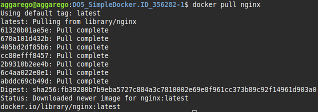
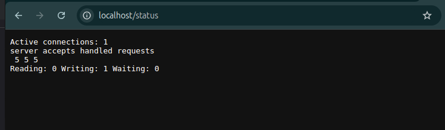
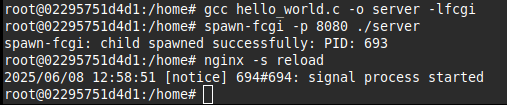
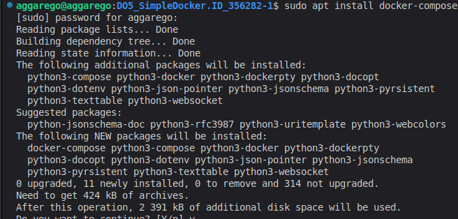

## Part 1. Готовый докер

1. Взял официальный докер-образ с nginx и выкачал его при помощи `docker pull nginx`.

    

2. Проверил наличие докер-образа через `docker images`.

    

3. Запустил докер-образ через `docker run -d nginx` и проверил, что образ запущен через `docker ps`. -d - нужен для запуска контейнера в фоне.

    

4. Посмотрел информацию о контейнере через `docker inspect [container_id|container_name]`.

    

5. Определил размер контейнера, список замапленных портов и ip контейнера (--size - для вывода размера контейнера, SizeRootFs - общий размер файловой системы контейнера).

    

    

    

6. Остановил контейнер через `docker stop [container_id|container_name]`. Проверил, что контейнер остановился через `docker ps`.

    

7. Запустил контейнер с портами 80 и 443 в контейнере, замапленными на такие же порты на локальной машине, через команду `docker run -d -p 80:80 -p 443:443 nginx`. `-p` необходим для указания мапа портов. 

    

8. Проверил, что в браузере по адресу `localhost:80` доступна стартовая страница nginx.

    

9. Перезапустил докер контейнер через `docker restart [container_id|container_name]`.

    

## Part 2. Операции с контейнером

1. Прочитал конфигурационный файл nginx.conf внутри докер контейнера через команду `docker exec -ti [id] bash`. `exec` - выполнение команды в контейнере, `-t` - создает псевдо-терминал, `-i` - подключает stdin, `bash` - запуск командной оболочки shell.

    

2. Скопировал `nginx.conf` на локальную машину. Настроил в нем по пути `/status` отдачу страницы статуса сервера nginx. `stub_status on;` в Nginx активирует встроенный модуль для отображения базовой статистики сервера.

    

3. Скопировал созданный файл nginx.conf внутрь докер-образа через команду `docker cp`. Перезапустил nginx внутри докер-образа через команду `exec`.

    

4. Проверил, что по адресу localhost:80/status отдается страничка со статусом сервера nginx.

    

5. Экспортировал контейнер в файл container.tar через команду `docker export`.

    

6. Остановил контейнер `docker stop [id]`. Удалил образ через `docker rmi -f [image_id|repository]`, не удаляя перед этим контейнеры. `-f` - принудительное удаление. Удалил остановленный контейнер `docker rm [id]`.

    

7. Импортировал контейнер обратно через команду `docker import container.tar`.

    

    

8. Запустил импортированный контейнер. `-g 'daemon off;` -  вручную указывает Docker, какую команду выполнить внутри контейнера (в данном случае — запустить Nginx в foreground-режиме). Для избежания ошибки: docker: Error response from daemon: no command specified, тк нет инструкции, что запускать по умолчанию.

    

9. Проверил, что по адресу localhost:80/status отдается страничка со статусом сервера nginx.

    

## Part 3. Мини веб-сервер

1. Написал мини-сервер на C и FastCgi, который будет возвращать простейшую страничку с надписью Hello, World!. FCGI_Accept() оджидает запроса, Content-type: text/html - указывает тип возвращаемых данных

    

2. Написал свой nginx.conf, который будет проксировать все запросы с 81 порта на 127.0.0.1:8080. fastcgi_pass 127.0.0.1:8080; - Перенаправляет запросы на FastCGI-сервер. include fastcgi_params; - Подключает стандартный набор параметров FastCGI.

    

3. Запустил локально nginx с написанной конфигурацией, написанный мини-сервер через spawn-fcgi на порту 8080 и перезагрузил.

    

    

    

4. Проверил, что в браузере по localhost:81 отдается написанная страничка.

    

## Part 4. Свой докер

1. Написал свой докер-образ (без множественных вызовов команд RUN), который:
    * собирает исходники мини сервера на FastCgi из Части 3;
    * запускает его на 8080 порту;
    * копирует внутрь образа написанный ./nginx/nginx.conf;
    * запускает nginx.

    

    

2. Собрал написанный докер-образ через `docker build` при этом указав имя и тег, `-t` — флаг для задания имени и тега создаваемого образа. `.` - yказывает контекст сборки — папку, в которой Docker будет искать Dockerfile и другие файлы, необходимые для сборки.

    

3. Проверил через `docker images`, что все собралось корректно.

    

4. Запустил собранный докер-образ с маппингом 81 порта на 80 на локальной машине и маппингом папки ./nginx внутрь контейнера по адресу, где лежат конфигурационные файлы nginx'а. `-v` - подключение файла с хоста в контейнер

    

5. Проверил, что по localhost:80 доступна страничка написанного мини сервера.
    
    

6. Дописал в `./nginx/nginx.conf` проксирование странички `/status`, по которой надо отдавать статус сервера nginx.

    

7. Пересобрал докер-образ и проверил, что теперь по localhost:80/status отдается страничка со статусом nginx.

    

## Part 5. Dockle

1. Установил dockle и просканировал образ из предыдущего задания через `dockle [image_id|repository]`.

    

2. Исправил образ так, чтобы при проверке через dockle не было ошибок (FATAL) и предупреждений (WARN). CIS-DI-0010 связано с нерекомендованным хранением gpg-ключей в официальном образе nginx,  dockle детектирует переменную окружения NGINX_GPGKEYS в процессе сборки базового образа nginx, что вызывает ошибку.

    

    

3. Убедился, что все по-прежнему работает. 

    

## Part 6. Базовый Docker Compose

1. Установил docker-compose

    

2. Написал файл `docker-compose.yml`, с помощью которого:
    * Поднимается докер-контейнер из Части 5 (он должен работать в локальной сети, т. е. не нужно использовать инструкцию EXPOSE и мапить порты на локальную машину).
    * Поднимается докер-контейнер с nginx, который будет проксировать все запросы с 8080 порта на 81 порт первого контейнера.
    * Мапится 8080 порт второго контейнера на 80 порт локальной машины.
    
    

    * depends_on: app - запускает nginx_proxy только после запуска app
    * volumes - монтирование своего конфига в контейнер.

    

3. Остановил все запущенные контейнеры. Собрал и запустил проект с помощью команд `docker-compose build` и `docker-compose up`.

    

4. Проверил, что в браузере по `localhost:80` отдается написанная страничка, как и ранее.

    

    
